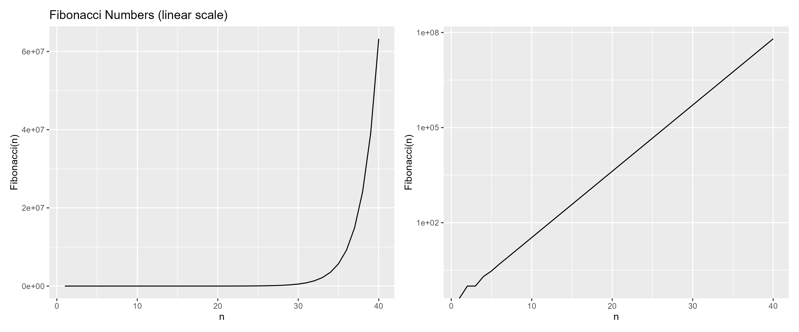

# title
# narrative: 06/26/25 insert text this git commit readme is baed on the youtube video from Nicole Smartwood and Christian Testa of Harvard University 
 Headings and links can go in .md files 
 
 ### data visualization of fibonacci numbers
 # syntax to include image: 
 